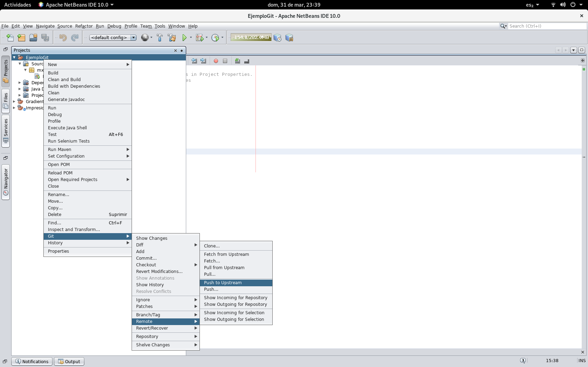
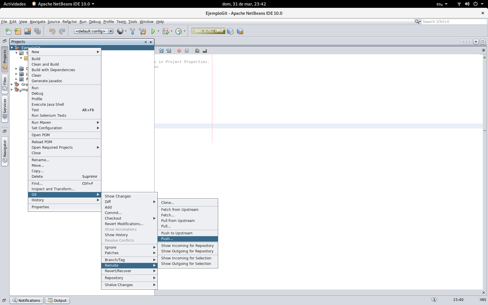
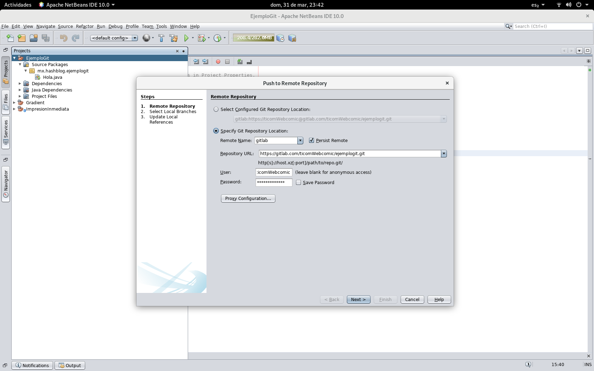
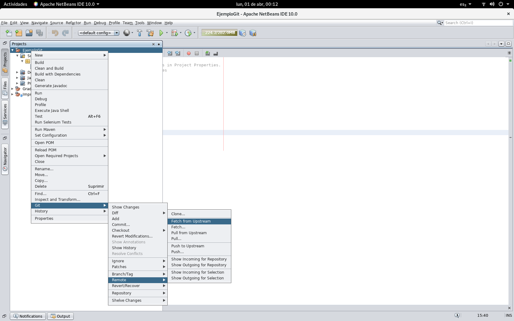
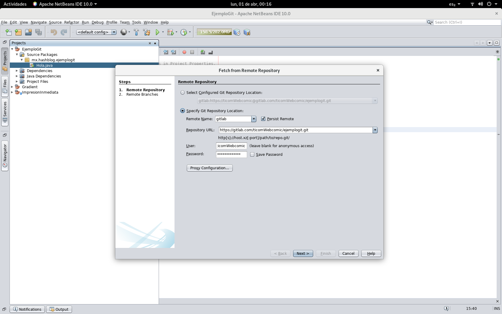
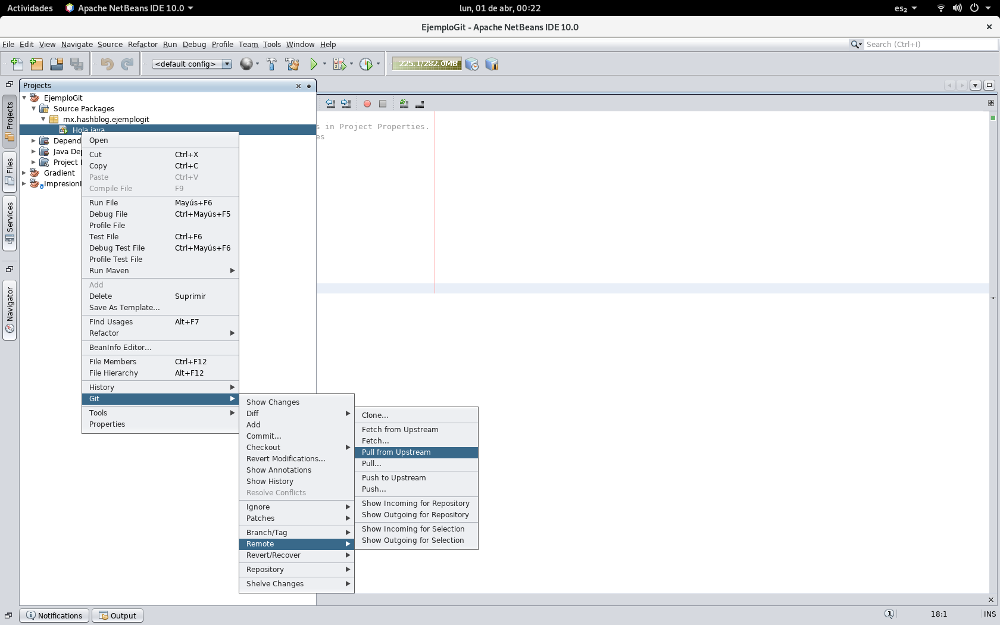
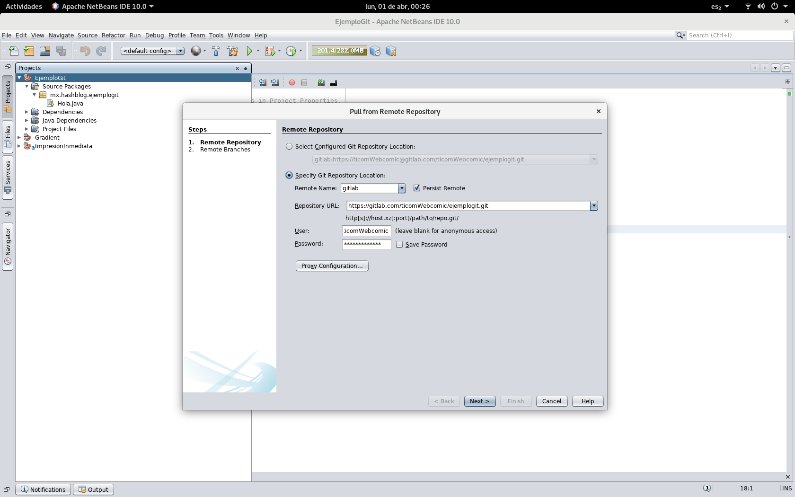

# Subiendo y bajando cambios a GitHub y Gitlab desde NetBeans
Bueno ya configuró NetBeans para usar un repositorio remoto ya sea en GitHub o Gitlab, ya clonó el repositorio en su equipo ¡Hora de trabajar!, hacemos unos cambios, corregimos un bug, refactorizamos código espagueti y configuramos la maquina de Q/A para calar el código en el equipo de prueba (para saltarnos el “Funcionó en mi maquina”), ahora ¿Como subo y bajo mis cambios al repositorio remoto?

## Subiendo cambios
Para subir sus cambios al repositorio remoto primero debe guardarlos en su repositorio local en la rama que esta subiendo al repositorio remoto, hecho esto vaya al menú Git->remote->push to remote.

Esto automáticamente subira los cambios al repositorio por defecto, si quisiéramos enviar los cambios a un repositorio en especifico debe usar el menú Push

Que le deja seleccionar el repositorio remoto que desea usar

## Bajando Cambios
Ahora ¿Como obtiene los cambios que subió desde otra maquina o los que realizo algún compañero de trabajo? con ayuda de los comandos fetch y pull.

El comando fetch baja la lista de cambios de todas las ramas, no los cambios en si, de modo que podamos seleccionar los cambios de las ramas que deseamos, para bajar los cambios del repositorio por defecto vamos al menú “Git->Remote->Fetch from Upstream”

De modo similar si deseamos bajar la lista de cambios de otro repositorio usaremos el menú “Git->Remote->Fetch”

Ya que tengamos los cambios del repositorio remoto podemos bajarlos con pull, si deseamos los cambios del repositorio por defecto usamos “Git->Remote-Pull from Stream

Y como con los comandos anteriores, si deseamos bajar cambios desde otro repositorio que no sea el por defecto, usaremos “Git->Remote->Pull” para seleccionar el repositorio y rama que deseamos bajar.

Espero que esta entrada les fuera de utilidad, nos vemos en la próxima y si desean cooperar con la causa.
